# Department App

Department App is a web application that provides information about departments and employees

The application should provide such functionality:

   1\. Adding and storing departments and employees in the database

   2\. Display the lists of departments and employees

   3\. Ability to add, edit and delete departments and employees

   5\. Display the number, average salary (calculated automatically based on the employees' salaries) of employees for each department

   6\. Ability to assign an employee to the department
***
### Home page

When the user enters the home page, they see a large heading and a short description of what this application can do.

#### Main scenario:

User opens a site and see the home page

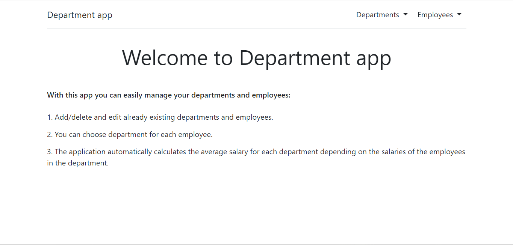

Pic. 1 The home page 

***
### Browse departments

Display the list of departments

#### Main scenario:

User clicks the 'Departments' drop-down list on the home page and chooses 'Browse departments' which redirects them to the departments page where they can see the following columns:

   1\. Name
   
   2\. Organisation
   
   3\. Employee Count
   
   4\. Average Salary (average salary of all employees in department)
   
   5\. Edit (when clicked redirects to the edit departments page where user can add/edit/delete departments)
   
   6\. Delete (immediately delete a department without any redirects)
   

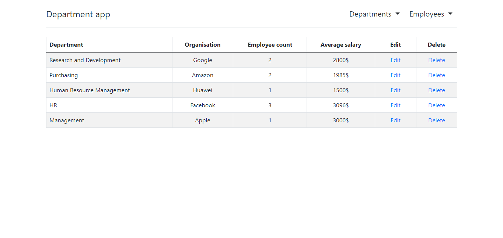

Pic. 2 The list of departments
***
### Manage departments

Display departments managing page

#### Main scenario:

User clicks the 'Departments' drop-down button on the home page and chooses 'Manage departments' which redirects them to the departments page where they can see the following:

   1\. Drop-down button 'Add departments' which allows user to add new departments.
   
   2\. Drop-down button 'Edit departments' which allows user to edit existing departments.
   
   3\. Drop-down button 'Delete departments' which allows user to delete existing departments
   
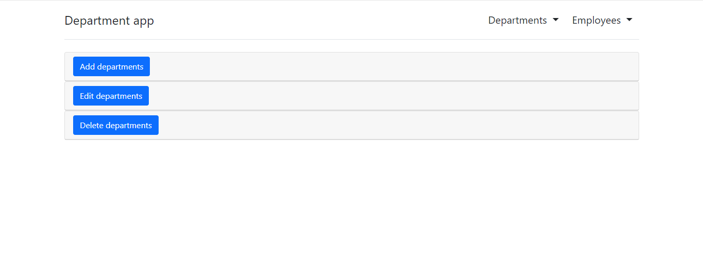

Pic. 3.1 Manage departments page

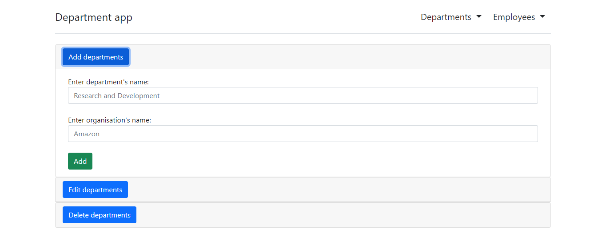

Pic. 3.2 Add departments

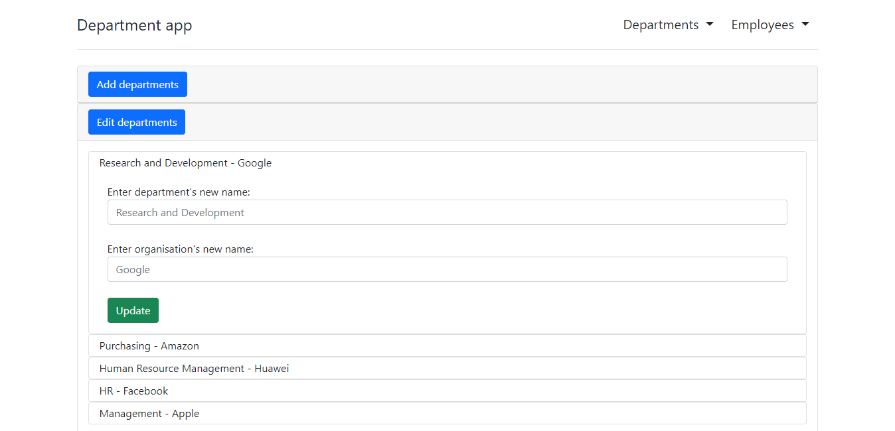

Pic. 3.3 Edit departments

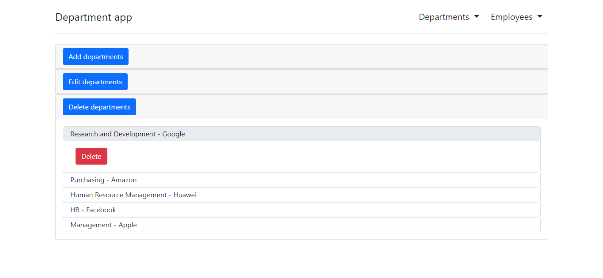

Pic. 3.4 Delete departments
***
### Browse employees

Display the list of employees

#### Main scenario:

User clicks the 'Employees' drop-down list on the home page and chooses 'Browse employees' which redirects them to the employees page where they can see the following columns:

   1\. Employee (name of the employee)

   2\. Birth date 

   3\. Salary

   4\. Department (to which the employee belongs)

   5\. Edit (when clicked redirects to the manage employees page where user can add/edit/delete employees)

   6\. Delete (immediately delete an employee without any redirects)

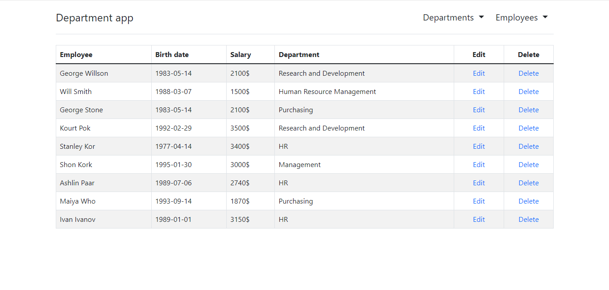

Pic. 4 The list of employees
***
### Manage employees

Display employee managing page

#### Main scenario:

User clicks the 'Employee' drop-down button on the home page and chooses 'Manage employees' which redirects them to the employees page where they can see the following:

   1\. Drop-down button 'Add employees' which allows user to add new employees.
   
   2\. Drop-down button 'Edit employees' which allows user to edit existing employees.
   
   3\. Drop-down button 'Delete employees' which allows user to delete existing employees
   
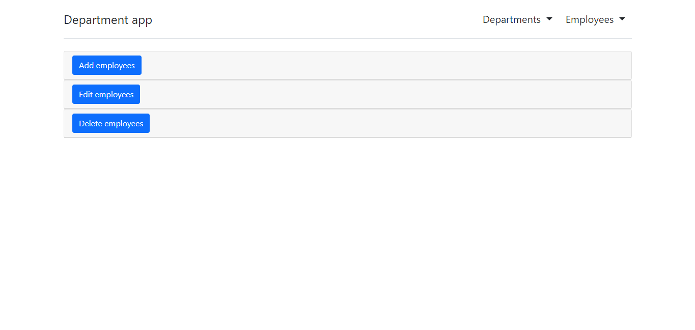

Pic. 4.1 Manage employees page

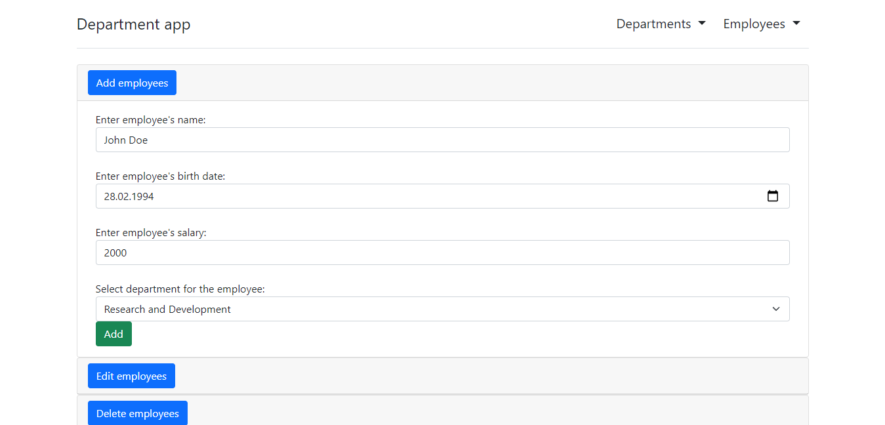

Pic. 4.2 Add employees

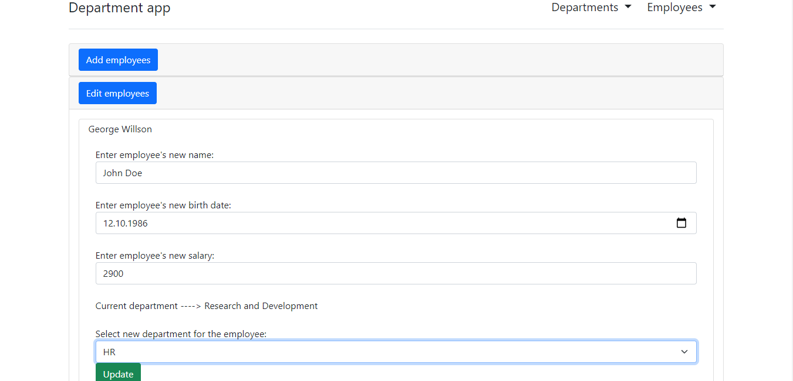

Pic. 4.3 Edit employees

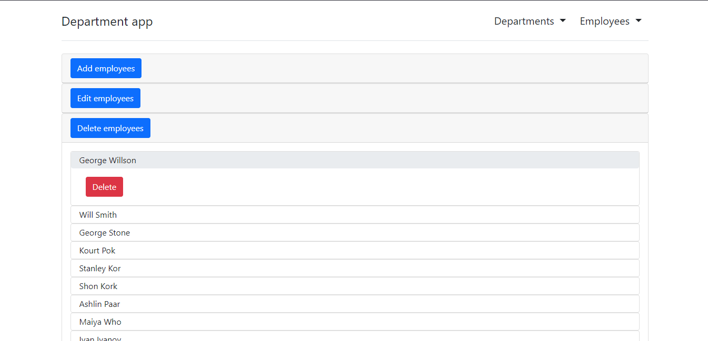

Pic. 4.4 Delete employees
***
